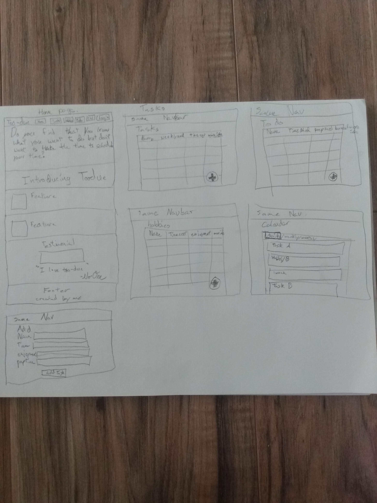

# Juniors Spring Intensive Deliverable Proposal

## TODO: copy this file, fill it out, and push it up to your project's repo.

Dates 3/16-3/25

**My Name: John Miner**

**Project Name: Too Due**

**Is your project New or Old? It is New.**

**Is your project Solo or Team? Doing this Solo.**

## Description

**This application is for procrastinators and though people that need help with time management. Too-Due helps them organize time and be more productive by optimizing their schedule and sending them reminders. The reason that i want to create this application is because I have a productivity application that I use but I really hate figuring out when to do things, so I want it to tell me the most optimum way of completing my tasks and housework and hobbies.**

## Challenges I Anticipate

**Crud on the todo list items
Working with google calendar api
Generating an optimum schedule
Sending user notifications
Gathering feedback to personalize user schedules**

## Skateboard

**Create todo-list/ hobbies list/ daily tasks list (CRUD each of these)
this will be a backend. Creating a rudimentary frontend as well.**

## Bike
**Connection to google calendar api to manually schedule times. (I want the each
of the three lists to be separate from the calendar then be able to be assigned
to different times later as the user or optimizer sees fit.)**

## Car
**Create the ability to optimally schedule tasks without much user input. I am
still working on the specifics but hopefully it will create priorities based on
when todo list items need to be done, as well as when daily tasks need to be done
as well into taking into account how much time each will take. Next it will prioritize
hobbies and habits that the user want to include in their day.**

## Personal Achievement Goals:

**Each teammate must achieve 2 of 3 of their self-set personal achievement goals. If you're not on a team, delete the other teammate sections as needed.**

### Teammate 1

1. Todo/hobies/daily tasks list
2. Google calendar Api
3. optimizing

## Wireframes

## Evaluation

**You must meet the following criteria in order to pass the intensive:**

- Students must get proposal approved before starting the project to pass
- SOLO
    - must score an average above a 2.5 on the [rubric]
- TEAM
    - Must score an average above 3 on the [rubric]
    - Each individual completes 2 of the 3 personal achievement goals from their proposal
- Pitch your product

[rubric]:https://docs.google.com/document/d/1IOQDmohLBEBT-hyr-2vgw1mbZUNsq3fHxVfH0oRmVt0/edit

## Approval Checklist
- [ ] If I have a team project, I wrote this proposal to represent my work and only my work
- [ ] I have completed all the necessary parts of this proposal
- [ ] I linked my proposal in the Spring Intensive Tracker

### Sign off

**Student Name:**                
> John Miner / 05-16-2020
**Make School Advisor Name**
> Alan
